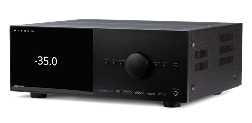

# Anthem MRX x40 Receiver Driver for Hubitat

This driver for Hubitat hub enables support for Anthem MRX x40 series Receivers. 
This driver support multi-zone operation and allows for control of each receiver zone independentally. 

[^1]

[^1]: Image copyrights to Anthem. https://www.anthemav.com/

## Features

1. **Multiple Zone Support**: The driver creates a sub-device for each selected
zone, allowing full control of each zone separately. This enables users to
manage different zones with ease and flexibility.
2. **Event Listening**: Devices also listen to events from the receiver, so the
device will reflect the current state of the device when changed through other
means. This ensures up-to-date information and seamless integration with
automation workflows.

## Installation

1. Install main driver from [here](https://raw.githubusercontent.com/yonatan-mitmit/HubitatAnthem/main/AnthemMain.groovy)
2. Install zone driver from [here](https://raw.githubusercontent.com/yonatan-mitmit/HubitatAnthem/main/AnthemChild.groovy)
3. Create a virtual device and select the _Anthem MRX x40 Receiver Driver_ as the driver for the virtual device
4. Configure the IP address for the receiver (see below)
5. Configure which zone you want active (select at least 1)

## Feedback and Comments

We appreciate feedback and comments from the community! Feel free to share your thoughts, report issues, in the [GitHub repository](https://github.com/yonatan-mitmit/HubitatAnthem)

## 
This project is not affiliated with Anthem. I'm a fan of their excellent products and wanted to connect them to my Hubitat hub.

## License
This project is licensed under the MIT License.